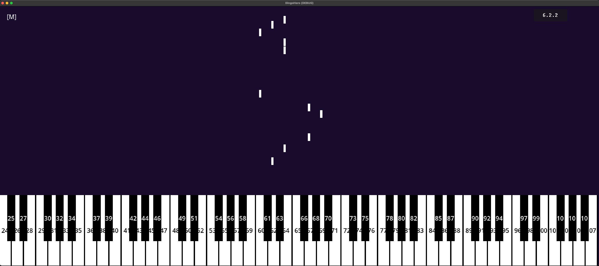

# dingohero
A somewhat educational rhythm game inspired by Synthesia and the falling note piano tutorials on YouTube.

The intent is to make a more game-like alternative with automatically synced backing tracks.

## Hiatus / Discontinued status
Development for DingoHero has been paused, or stopped.

This is what it looks like at the of writing this README:

- Spawns MIDI notes by reading a file
- Notes hit keyboard at the right time (compared against a backing track)
- Primitive audio / metronome sync implemented

See [MIDINGO](https://midingo.github.io/), the spiritual successor to dingohero.

## Gameplay
### Hardware Setup
Hook up a MIDI keyboard to your computer and the game should automatically detect it and accept input.

Triggering a note on your MIDI keyboard will trigger an input in-game and highlight the key you pressed on the onscreen piano keyboard.

### No Hardware Controller
If you don't have a MIDI keyboard or controller, you can still use your computer keyboard using any program that emulates a MIDI device.

## Maps
Maps are stored in folders as basic MIDI and audio files with a json file that stores map data.

### Creating a map
Because maps are not much more than MIDI, maps can be created with any program that allows MIDI editing such as your favorite DAW.
